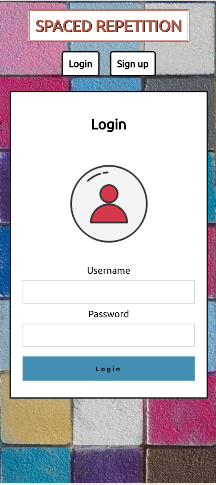

# Space Repetition

### Teammate: Leon Dail && Smiti Shakya


## Links

[Live Version](https://newest-spaced-rep-client.now.sh/)
[Client Repo](https://github.com/thinkful-ei-gecko/Smiti-Leon-new-spaced-repetition-client)
[Server Repo](https://github.com/thinkful-ei-gecko/Smiti-Leon-Spaced-Repetion-Server)

#### Demo log in account
      ```
       username: admin
       password: pass
      ```

## Summary

[Spaced Repetition](https://en.wikipedia.org/wiki/Spaced_repetition)? is technique that helps a user learn a language using thespaced-repetition algorithm which is proven to increase the rate of learning dramatically. This application contains beginnings to learning the Spanish language, starting with the English/Spanish translations of common musical instruments.

## Screeenshots 

## Desktop Landing Page


## Mobile Landing Page 


## Tech

- React
- JavaScript
- HTML5
- CSS
- Zeit/Now
- JWT


