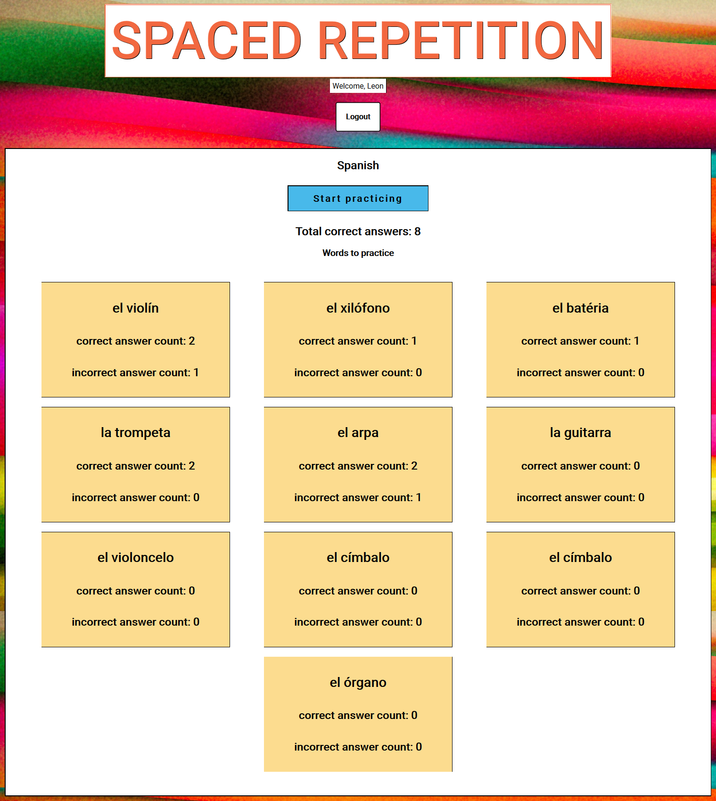
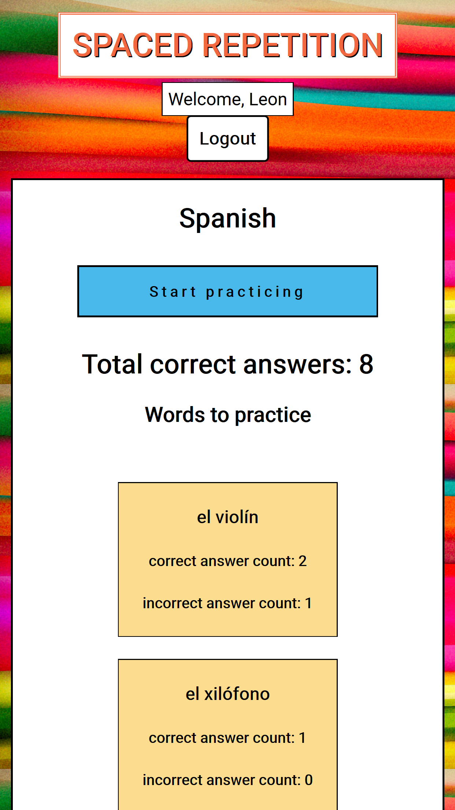

# El Instrumento

### Teammate: Leon Dail && Smiti Shakya

## Links

- Link to live app: [Live Version](https://client.ldail.now.sh/) 
- Link to client repo: [Client Repo](https://github.com/thinkful-ei-gecko/Smiti-Leon-new-spaced-repetition-client)
- Link to API repo: [Server Repo](https://github.com/thinkful-ei-gecko/Smiti-Leon-Spaced-Repetion-Server)

#### Demo log in account
      
       username: admin
       password: Password1!

## Summary

El Instrumento is an application that helps a user learn a language using the [Spaced Repetition](https://en.wikipedia.org/wiki/Spaced_repetition) algorithm which is proven to increase the rate of learning dramatically. This version contains beginnings to learning the Spanish language, starting with the English/Spanish translations of common musical instruments.

  

## Screeenshots 

## Desktop Landing Page

## Mobile Landing Page 

## Tech

- React
- HTML5
- CSS
- Zeit/Now
- JWT

